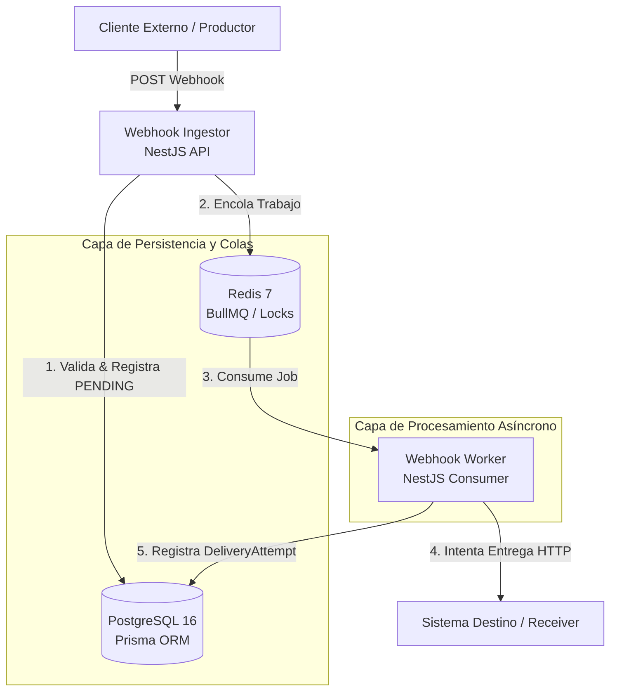
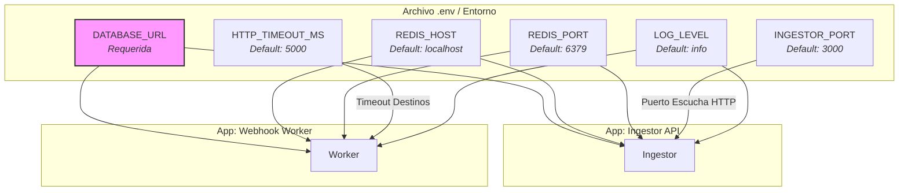

# 🚀 Webhook Hub


Sistema distribuido y de alta disponibilidad para la recepción, validación, encolamiento y entrega resiliente de webhooks.

Webhook Hub funciona como una capa intermedia inteligente (*middleware*) entre los productores de eventos y los sistemas destinos externos, aislando los fallos de red, absorbiendo picos de tráfico y garantizando una entrega eventual mediante arquitecturas orientadas a eventos (*event-driven*).

---

# 📌 Tabla de Contenidos

- [Características](#-características)
- [Arquitectura](#-arquitectura)
- [Stack Tecnológico](#-stack-tecnológico)
- [Flujo del Sistema](#-flujo-del-sistema)
- [Estructura del Proyecto](#-estructura-del-proyecto)
- [Modelo de Datos](#-modelo-de-datos)
- [Seguridad](#-seguridad)
- [Observabilidad](#-observabilidad)
- [Instalación y Ejecución Local](#-instalación-y-ejecución-local)
- [Variables de Entorno](#-variables-de-entorno)
- [Testing](#-testing)
- [Roadmap y Pendientes](#-roadmap-y-pendientes)

---

# ✨ Características

## 📩 Recepción de Eventos
- **Endpoint unificado:** Punto de entrada HTTP estructurado mediante `POST /api/v1/webhooks/:source/:type`.
- **Validación robusta:** Validación estricta de esquemas y payloads en tiempo de ejecución con `class-validator` y `ValidationPipe`.
- **Control perimetral:** Restricciones de tamaño en solicitudes de entrada (`express.json` limitado a `256kb`) para evitar ataques DoS.

## ⚙️ Procesamiento Asíncrono
El sistema desacopla de forma estricta la **ingesta de datos** del **procesamiento y entrega**, delegando el transporte a colas de mensajes gestionadas por BullMQ y Redis.

### Ventajas principales:
* **Respuesta ultra rápida:** El cliente productor recibe un código HTTP `202 Accepted` de inmediato, liberando sus hilos de ejecución.
* **Tolerancia a fallos:** Si el sistema destino está caído, el evento no se pierde; se retiene en la infraestructura para su posterior reintento.
* **Aislamiento de picos de carga:** Redis actúa como un amortiguador (*buffer*), protegiendo a los servidores internos y externos de saturación de tráfico.
- **Escalabilidad horizontal:** El `ingestor` y el `worker` pueden escalar de forma independiente según las necesidades específicas del tráfico.
---
# 🧰 Stack Tecnológico

### Backend
| Tecnología | Uso / Responsabilidad |
| :--- | :--- |
| **TypeScript (v5.x)** | Lenguaje tipado principal para todo el monorepo. |
| **NestJS (v10.x)** | Framework empresarial para estructurar aplicaciones modulares y escalables. |
| **BullMQ** | Sistema de mensajería basado en colas de prioridad y reintentos para NodeJS. |
| **Prisma ORM** | Modelado de datos y abstracción tipada de consultas SQL. |
| **PostgreSQL (v16)** | Base de datos relacional para la persistencia transaccional y auditoría de eventos. |
| **Redis (v7)** | Almacenamiento en memoria para colas de BullMQ, rate limiting, caché e idempotencia. |

### Infraestructura y Observabilidad
| Tecnología | Uso / Responsabilidad |
| :--- | :--- |
| **Docker & Compose** | Contenerización uniforme de servicios y orquestación del entorno local. |
| **Prometheus** | Recolección y serie temporal de métricas de rendimiento y negocio. |
| **Grafana** | Paneles visuales e indicadores operacionales (Dashboards as Code). |

---

# 🏗 Arquitectura


---
sequenceDiagram
    participant C as Cliente Externo
    participant I as Ingestor API
    participant R as Redis (BullMQ)
    participant DB as PostgreSQL
    participant W as Worker
    participant D as Destino Externo

    C->>I: POST /api/v1/webhooks/:source/:type
    activate I
    I->>I: Validar Seguridad (API Key, HMAC, IP, JWT)
    I->>R: Verificar Idempotency-Key (Lock)
    alt Es duplicado
        I-->>C: HTTP 200 {"status": "duplicate"}
    else Es evento nuevo
        I->>DB: Registrar WebhookEvent (status: PENDING)
        I->>R: Encolar Trabajo (process-webhook)
        I-->>C: HTTP 202 {"status": "accepted", "id": "job_id"}
    end
    deactivate I

    activate W
    W->>R: Extraer / Consumir Job de la cola
    W->>W: Validar Circuit Breaker del destino
    alt Circuito Abierto (Abierto por fallos previos)
        W->>DB: Registrar DeliveryAttempt (status: FAILED)
    else Circuito Cerrado / Half-Open
        W->>D: POST Payload (Con Timeout configurado)
        alt Entrega Exitosa (HTTP 2xx)
            D-->>W: Respuesta exitosa
            W->>DB: Registrar Intento (DELIVERED) & Actualizar Evento
            W->>W: Reportar éxito al Circuit Breaker
        else Error en Entrega (HTTP 4xx/5xx / Timeout)
            D-->>W: Error o Red Caída
            W->>W: Reportar fallo al Circuit Breaker
            alt Quedan reintentos disponibles
                W->>R: Reencolar con Backoff Exponencial + Jitter
                W->>DB: Registrar Intento (RETRYING)
            else Reintentos Agotados
                W->>DB: Registrar Intento (DEAD_LETTER) & Actualizar Evento
            end
        end
    end
    deactivate W
---
webhook-hub
├── apps
│   ├── ingestor           # 🚀 API HTTP para recepción, validación y seguridad de entrada.
│   └── worker             # ⚙️ Consumidor asíncrono, políticas de resiliencia y reintentos.
├── packages
│   ├── database           # 🗄️ Cliente de Prisma, esquemas, migraciones y repositorios base.
│   └── shared             # 📦 Contratos comunes: DTOs, Enums, interfaces y constantes.
├── infra
│   ├── docker             # 🐳 Archivos Dockerfile y docker-compose.yml de infraestructura.
│   ├── prometheus         # 📈 Configuración de scraping e intervalos de métricas.
│   └── grafana            # 📊 Provisionamiento automático de datasources y dashboards.
├── docs                   # 📚 Planes de arquitectura, auditorías y guías técnicas.
└── scripts                # 🔧 Utilidades globales, automatizaciones y scripts de seed.
---
erDiagram
    WEBHOOK_EVENT ||--o{ DELIVERY_ATTEMPT : "genera"
    DESTINATION ||--o{ WEBHOOK_EVENT : "recibe"

    WEBHOOK_EVENT {
        string id PK
        string source
        string type
        json data
        string idempotencyKey UK
        DeliveryStatus status
        datetime createdAt
        datetime updatedAt
    }

    DELIVERY_ATTEMPT {
        uuid id PK
        string eventId FK
        int attempt
        DeliveryStatus status
        int httpStatus
        int latencyMs
        string error
        string workerId
        datetime createdAt
    }

    DESTINATION {
        uuid id PK
        string name UK
        string url
        string apiKey UK
        string[] allowedIps
        boolean isActive
        CircuitBreakerState circuitState
        int failureCount
        datetime lastFailureAt
        datetime createdAt
---
# 📦 Entidades Principales

### 📩 WebhookEvent
Representa el ciclo de vida y el contenido del evento recibido en la plataforma.

| Campo | Tipo | Descripción |
| :--- | :--- | :--- |
| **id** | `String` | Identificador único del evento (UUID o Snowflake). |
| **source** | `String` | Origen o sistema que mitió el evento (ej. `billing`). |
| **type** | `String` | Tipo específico de evento (ej. `invoice.created`). |
| **data** | `JSON` | Payload crudo en formato JSON enviado por el productor. |
| **idempotencyKey** | `String` | Token único enviado en los headers para prevenir el procesamiento duplicado. |
| **status** | `Enum` | Estado global simplificado del evento (`DeliveryStatus`). |

---

### 📤 DeliveryAttempt
Registra cada ejecución física de la llamada HTTP despachada hacia el receptor externo.

| Campo | Tipo | Descripción |
| :--- | :--- | :--- |
| **attempt** | `Int` | Contador correlativo del intento actual (ej. 1, 2, 3...). |
| **status** | `Enum` | Resultado específico de este intento de entrega. |
| **latencyMs** | `Int` | Tiempo de respuesta de la red externa medido en milisegundos. |
| **httpStatus** | `Int` | Código de estado HTTP devuelto por el servidor destino. |
| **error** | `String` | Mensaje de error de red o stack trace resumido (ej. `TIMEOUT`, `ECONNREFUSED`). |

---

### 🌐 Destination
Representa los sistemas destinos externos que están registrados y autorizados en la plataforma para recibir webhooks.

| Campo | Tipo | Descripción |
| :--- | :--- | :--- |
| **circuitState** | `Enum` | Estado actual del Circuit Breaker asignado al destino (`CLOSED`, `OPEN`, `HALF_OPEN`). |
---
[PENDING] ---> (Intento de Envío)
      |
      ├───> [DELIVERED]  (Éxito - Código HTTP 2xx)
      |
      ├───> [RETRYING]   (Fallo temporal - Reencolado con Backoff)
      |
      └───> [DEAD_LETTER] / [FAILED] (Fallo definitivo / Intentos agotados)
---
# 🛡️ Seguridad

## 🔑 Autenticación por API Key
Cada cliente debe registrarse previamente en la plataforma y proveer su credencial autorizada mediante las cabeceras HTTP:

```http
x-api-key: wh_live_a1b2c3d4e5f6...
```
---
🔏 Validación de Firmas HMAC SHA-256
Garantiza el no repudio y la integridad de los datos de extremo a extremo. El Ingestor calcula una firma digital utilizando el cuerpo crudo de la petición (rawBody) junto a una clave secreta compartida, pasándola a comparar directamente con el header provisto por el emisor:

flowchart TD
    A[Payload Recibido: rawBody] --> B[Generar Firma HMAC SHA-256 usando Secret Key]
    B --> C{¿Es igual a x-signature?}
    C -->|Sí| D[Evento Aceptado]
    C -->|No| E[HTTP 401 Unauthorized]

x-signature: t=1672531199,v1=g3h21j4...
---
🌐 Otras Capas Defensivas
IP Whitelisting: Filtro perimetral incorporado a nivel de aplicación que descarta inmediatamente peticiones provenientes de IPs fuera de los rangos CIDR permitidos por destino.

OAuth2 / JWT Bearer Validation: Soporte para la decodificación y validación estricta de tokens de acceso centralizados que contengan el scope explícito webhook:send.

Protección Anti-SSRF: El cliente HTTP embebido en el Worker bloquea de forma nativa peticiones maliciosas dirigidas a interfaces e infraestructuras internas (ej. localhost, 127.0.0.1, 169.254.169.254).
---
📈 Observabilidad
El sistema expone métricas nativas y registros estructurados listos para ecosistemas de monitoreo en la nube:

Métricas Prometheus: El Ingestor expone de manera pública el endpoint /api/v1/metrics utilizando la librería estándar prom-client.

Métricas Clave: Monitoreo activo de la tasa de solicitudes por segundo (RPS), códigos de error HTTP de entrada, tiempos de latencia en la entrega externa, volumen de eventos caídos en DEAD_LETTER y estado de las colas de Redis.

Logs Estructurados: Implementación integral de Pino Logger, imprimiendo trazas en formato JSON plano de alta velocidad, ideal para su indexación en agregadores como Datadog, Kibana o Grafana Loki.

🚀 Instalación y Ejecución Local
Prerrequisitos
Node.js 20 LTS o superior.

Docker y Docker Compose instalados de forma global.
1. Clonar e Instalar Dependencias
Bash
git clone https://github.com/tu-usuario/webhook-hub.git
cd webhook-hub
npm install
2. Inicializar la Infraestructura con Docker Compose
Este comando compilará los contenedores locales y descargará las imágenes oficiales de Redis, PostgreSQL, Prometheus y Grafana de forma automatizada:

Bash
docker compose -f infra/docker/docker-compose.yml up --build

3. URLs de Acceso del Entorno Local
Ingestor API: http://localhost:3000

Prometheus UI: http://localhost:9090

Grafana Dashboards: http://localhost:3001 (Usuario: admin / Contraseña: admin)

🔧 Comandos Útiles

# Compilar todos los workspaces del monorepo
npm run build

# Ejecutar la suite de pruebas unitarias e integrales
npm run test

# Ejecutar el linter estático
npm run lint

# Formatear el código fuente con Prettier
npm run format

# Levantar únicamente los servicios de soporte (sin las aplicaciones Node)
docker compose -f infra/docker/docker-compose.yml up redis postgres prometheus grafana

Ejecución individual por Workspace

# Ingestor en modo Hot-Reload (Desarrollo)
npm run start:dev -w @webhook-hub/ingestor

# Worker en modo Hot-Reload (Desarrollo)
npm run start:dev -w @webhook-hub/worker

Endpoints de la API
Ingesta de Webhooks

POST /api/v1/webhooks/:source/:type
Content-Type: application/json
x-api-key: <tu-api-key>
x-signature: <firma-hmac-sha256>
Idempotency-Key: <uuid-unico-de-peticion>
Authorization: Bearer <jwt-token>

Payload de ejemplo (body)

{
  "source": "billing",
  "type": "invoice.created",
  "data": {
    "invoiceId": "inv_123",
    "amount": 100
  }
}

Respuestas esperadas
HTTP 202 (Accepted): El evento es válido y ha sido encolado exitosamente.

{
  "status": "accepted",
  "id": "job_12345"
}

HTTP 200 (OK - Duplicado): La llave de idempotencia ya fue procesada anteriormente.

{
  "status": "duplicate",
  "id": "idempotency_key_enviada"
}

---
### ⚙️ Variables de Entorno

Puedes configurar el comportamiento del sistema creando un archivo `.env` en la raíz de cada aplicación relevante (`apps/ingestor` y `apps/worker`).


---
# 🧪 Testing y Ciclo de Vida

El proyecto contiene una suite completa de pruebas unitarias y de integración distribuidas de forma modular en los diferentes entornos del monorepo.

```mermaid
flowchart LR
    subgraph Monorepo Testing
        root_test[npm run test] -->|Ejecuta todo| shared_t[@webhook-hub/shared <br/><i>Unitarias</i>]
        root_test --> db_t[@webhook-hub/database <br/><i>Mocks & Repositorios</i>]
        root_test --> ing_t[@webhook-hub/ingestor <br/><i>Integración HTTP</i>]
        root_test --> wrk_t[@webhook-hub/worker <br/><i>E2E / BullMQ</i>]
    end
    
    subgraph Cobertura
        cov[npm run test:cov] -->|Genera Reporte| html[LCOV / HTML Report]
    end
```
---
# Ejecutar todas las pruebas del monorepo
npm run test

# Ejecutar pruebas con reporte de cobertura (Coverage)
npm run test:cov

# Ejecutar pruebas unitarias de un workspace específico
npm run test -w @webhook-hub/shared
---
🗺️ Roadmap y Pendientes
El desarrollo del sistema está estructurado bajo las siguientes prioridades técnicas representadas en su hoja de ruta:

gantt
    title Roadmap de Implementación Webhook Hub
    dateFormat  X
    axisFormat %d
    
    section Core & Setup
    Seeding Operativo (scripts/seed.ts)         :active, p1, 0, 5
    Resolución Dinámica (DestinationRepo)      :active, p2, 2, 7
    
    section Observabilidad
    Endpoint del Worker (/metrics en 3001)     : p3, 5, 10
    Manejo de Alertas (Slack/PagerDuty)        : p4, 8, 14
    
    section Seguridad
    Criptografía Avanzada (Verificación JWKS)  : p5, 10, 16
---
flowchart LR
    A[Webhook Hub Core] --- B[Propiedad Corporativa Interna]
    A --- C[Licencia Open Source MIT]
---
