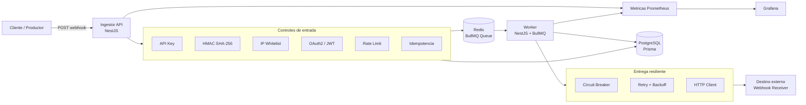
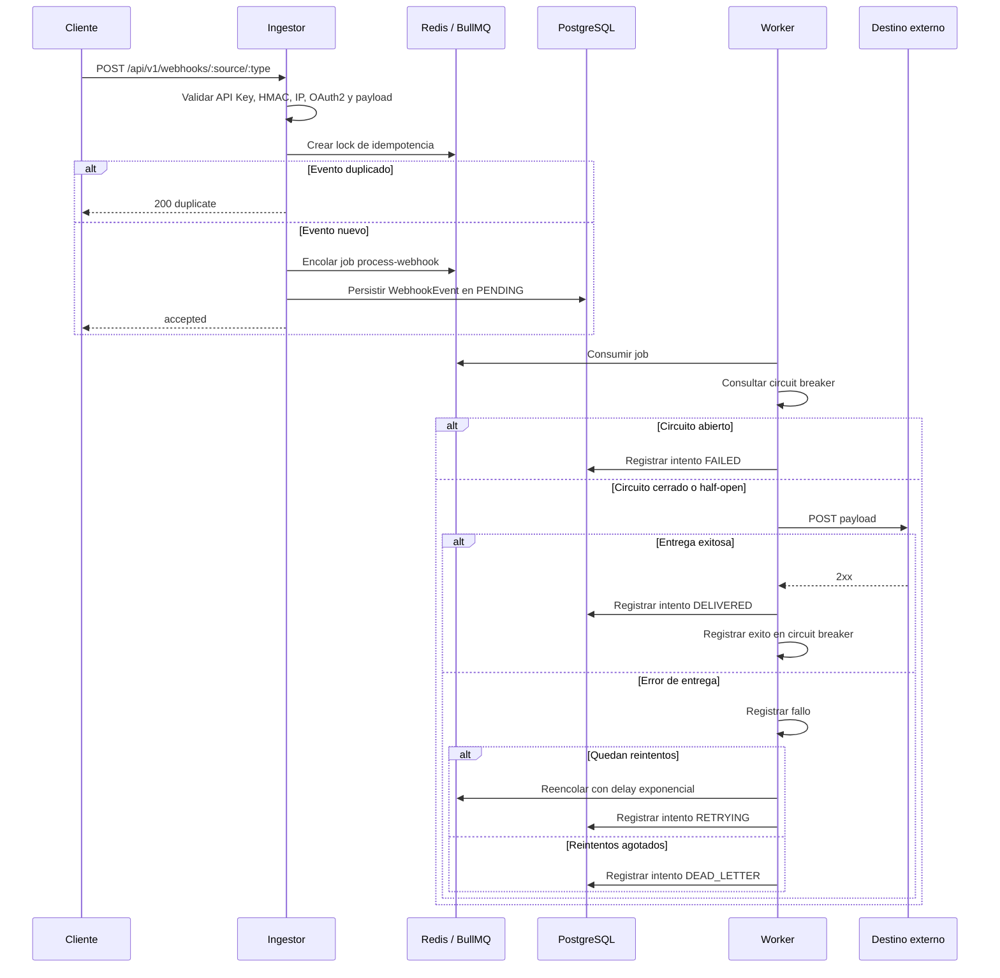
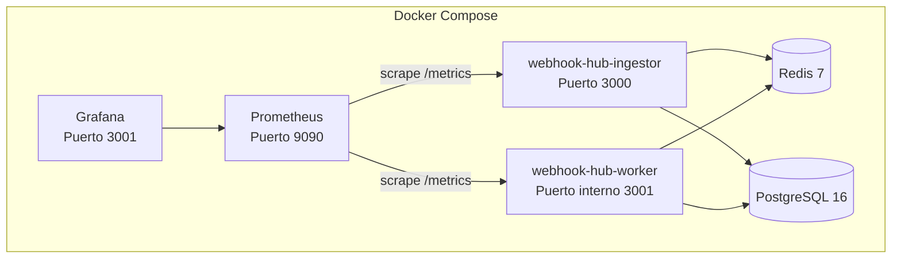
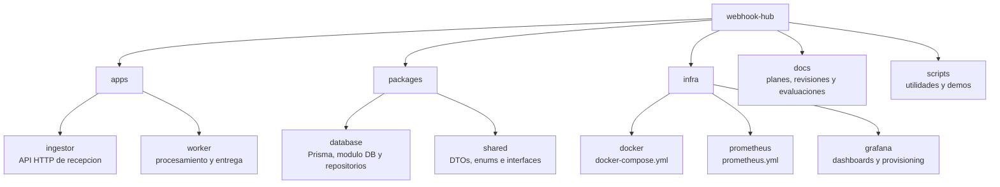
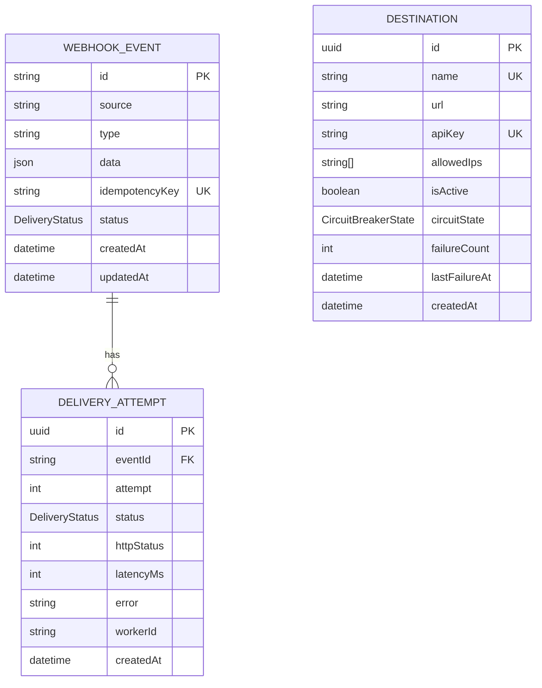
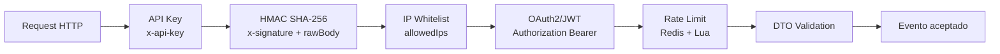
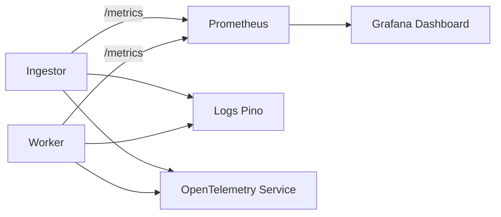

# Webhook Hub

Webhook Hub es una plataforma backend para recibir, validar, encolar, procesar y entregar webhooks de forma confiable. El proyecto esta construido como un monorepo TypeScript con NestJS, BullMQ, Redis, PostgreSQL, Prisma, Prometheus y Grafana.

El diseño separa la ingesta HTTP del procesamiento asincrono. Esto permite responder rapido al cliente productor del webhook, absorber picos de carga mediante cola, registrar intentos de entrega y aplicar resiliencia con reintentos, backoff exponencial y circuit breaker.

## Tabla de Contenido

- [Capacidades principales](#capacidades-principales)
- [Arquitectura](#arquitectura)
- [Flujo de procesamiento](#flujo-de-procesamiento)
- [Infraestructura local](#infraestructura-local)
- [Estructura del proyecto](#estructura-del-proyecto)
- [Modelo de datos](#modelo-de-datos)
- [Servicios y responsabilidades](#servicios-y-responsabilidades)
- [Seguridad](#seguridad)
- [Observabilidad](#observabilidad)
- [Ejecucion local](#ejecucion-local)
- [Comandos utiles](#comandos-utiles)
- [Endpoints](#endpoints)
- [Estado actual y pendientes](#estado-actual-y-pendientes)

## Capacidades Principales

- Ingesta de webhooks por HTTP mediante `POST /api/v1/webhooks/:source/:type`.
- Validacion de payloads con `class-validator` y `ValidationPipe`.
- Autenticacion y controles de acceso mediante API Key, HMAC SHA-256, whitelist de IP y validacion basica de token OAuth2/JWT.
- Idempotencia basada en `Idempotency-Key` y lock temporal en Redis.
- Encolamiento asincrono con BullMQ sobre Redis.
- Persistencia de eventos, destinos e intentos de entrega en PostgreSQL mediante Prisma.
- Procesamiento desacoplado por worker.
- Reintentos con backoff exponencial y jitter.
- Circuit breaker por destino para evitar cascadas de fallos.
- Metricas Prometheus y dashboards Grafana para el Ingestor; el Worker registra metricas internamente y tiene scraping configurado, pero aun requiere exponer su endpoint `/metrics`.
- Health checks de liveness/readiness para Ingestor.
- Suite de pruebas enfocada en DTOs, enums, metricas y servicios criticos.

## Arquitectura



La arquitectura usa un patron event-driven simple: el Ingestor valida y acepta eventos, Redis actua como broker de trabajo y el Worker ejecuta la entrega real. PostgreSQL conserva el estado del evento y la auditoria de intentos.

## Flujo de Procesamiento



## Infraestructura Local

La infraestructura de desarrollo se define en [infra/docker/docker-compose.yml](infra/docker/docker-compose.yml).



Servicios definidos:

| Servicio | Imagen / Build | Puerto host | Responsabilidad |
| --- | --- | --- | --- |
| `redis` | `redis:7-alpine` | `6379` | Cola BullMQ, locks de idempotencia, rate limit y circuit breaker |
| `postgres` | `postgres:16-alpine` | `5432` | Persistencia transaccional |
| `ingestor` | `apps/ingestor/Dockerfile` | `3000` | API publica de ingesta |
| `worker` | `apps/worker/Dockerfile` | No expuesto directamente | Consumidor de cola y entrega de webhooks |
| `prometheus` | `prom/prometheus` | `9090` | Recoleccion de metricas |
| `grafana` | `grafana/grafana` | `3001` | Visualizacion de dashboards |

> Nota: en Docker Compose, Grafana usa el puerto `3001` del host. El worker escucha internamente en `3001`, pero no publica ese puerto al host.

## Estructura del Proyecto



Directorios principales:

| Ruta | Descripcion |
| --- | --- |
| `apps/ingestor` | Servicio NestJS que recibe webhooks, aplica seguridad, valida payloads, controla idempotencia y encola jobs. |
| `apps/worker` | Servicio NestJS/BullMQ que consume jobs, entrega webhooks, aplica retry/backoff y registra intentos. |
| `packages/database` | Modulo compartido de base de datos, Prisma service y repositorios. |
| `packages/shared` | Contratos compartidos: DTOs, interfaces, estados y nombres de metricas. |
| `infra/docker` | Orquestacion local con Docker Compose. |
| `infra/prometheus` | Configuracion de scraping para Ingestor, Worker y Prometheus. |
| `infra/grafana` | Dashboard y provisioning de datasource/dashboards. |
| `docs` | Documentacion de fases, revisiones de arquitectura y seguridad. |
| `scripts` | Scripts auxiliares para seed o demos. |

## Modelo de Datos

El esquema Prisma esta en [packages/database/prisma/schema.prisma](packages/database/prisma/schema.prisma).



Estados soportados:

| Enum | Valores |
| --- | --- |
| `DeliveryStatus` | `PENDING`, `DELIVERED`, `FAILED`, `RETRYING`, `DEAD_LETTER` |
| `CircuitBreakerState` | `CLOSED`, `OPEN`, `HALF_OPEN` |

## Servicios y Responsabilidades

### Ingestor

El Ingestor es la frontera HTTP del sistema.

- Expone `POST /api/v1/webhooks/:source/:type`.
- Aplica `ApiKeyGuard`, `HmacGuard`, `IpWhitelistGuard` y `OAuth2Guard`.
- Aplica rate limit con Redis.
- Usa `Idempotency-Key` para evitar procesamiento duplicado.
- Encola eventos en la cola BullMQ `webhooks` con job `process-webhook`.
- Persiste el evento inicial con estado `PENDING`.
- Expone endpoints de salud y metricas.

### Worker

El Worker procesa los eventos de manera asincrona.

- Consume jobs desde la cola BullMQ `webhooks`.
- Evalua circuit breaker por destino.
- Realiza el `POST` HTTP hacia el destino.
- Registra latencia, resultado y errores.
- Programa reintentos con backoff exponencial y jitter.
- Registra intentos de entrega en PostgreSQL.
- Envia a estado `DEAD_LETTER` cuando se agotan los reintentos.
- Registra metricas de entrega mediante `MetricsService`; falta publicar un controlador HTTP `/metrics` en el Worker.

### Packages Compartidos

- `@webhook-hub/database`: modulo NestJS de base de datos, `PrismaService` y repositorios para eventos, destinos e intentos.
- `@webhook-hub/shared`: contratos comunes para mantener consistencia entre Ingestor, Worker y pruebas.

## Seguridad



Controles implementados:

| Control | Implementacion |
| --- | --- |
| API Key | Busca el destino activo por `x-api-key`. |
| HMAC | Calcula HMAC SHA-256 usando el `rawBody` y compara con `x-signature`. |
| IP Whitelist | Permite solo IPs configuradas en `Destination.allowedIps`; si no hay lista, permite por compatibilidad. |
| OAuth2/JWT | Decodifica token Bearer y valida expiracion, issuer, audience y scope `webhook:send` cuando aplican. |
| Rate limit | Contador atomico en Redis con script Lua: 1000 requests por minuto por cliente. |
| Idempotencia | Lock temporal en Redis usando `Idempotency-Key`. |
| Payload limit | `express.json` limitado a `256kb`. |
| SSRF basico | El HTTP client bloquea hosts sensibles como `localhost`, `127.0.0.1` y metadata endpoints. |

## Observabilidad



Componentes:

- `prom-client` para exponer metricas en formato Prometheus.
- Prometheus esta configurado para scrapear `ingestor:3000/metrics` y `worker:3001/metrics`.
- El Ingestor expone `/api/v1/metrics`; en el Worker el controlador HTTP de metricas esta pendiente de incorporarse.
- Grafana carga provisioning desde `infra/grafana`.
- Logs estructurados con Pino.
- Servicios base de OpenTelemetry presentes en ambos servicios.

Endpoints de salud del Ingestor:

| Endpoint | Descripcion |
| --- | --- |
| `GET /api/v1/health` | Estado basico, uptime y version. |
| `GET /api/v1/health/live` | Liveness check. |
| `GET /api/v1/health/ready` | Readiness check con Redis y PostgreSQL. |
| `GET /api/v1/metrics` | Metricas Prometheus del Ingestor. |

## Ejecucion Local

### Prerrequisitos

- Node.js 20 o superior.
- npm.
- Docker y Docker Compose.

### Instalacion

```bash
npm install
```

### Ejecutar con Docker Compose

```bash
docker compose -f infra/docker/docker-compose.yml up --build
```

Servicios disponibles:

- Ingestor: `http://localhost:3000`
- Prometheus: `http://localhost:9090`
- Grafana: `http://localhost:3001`

Credenciales por defecto de Grafana:

- Usuario: `admin`
- Password: `admin`

### Detener la infraestructura

```bash
docker compose -f infra/docker/docker-compose.yml down
```

Para eliminar tambien volumenes locales:

```bash
docker compose -f infra/docker/docker-compose.yml down -v
```

## Comandos Utiles

```bash
# Compilar todos los workspaces
npm run build

# Ejecutar pruebas de todos los workspaces que tengan test
npm run test

# Lint
npm run lint

# Formatear TypeScript
npm run format

# Levantar solo dependencias locales desde Docker Compose
docker compose -f infra/docker/docker-compose.yml up redis postgres prometheus grafana
```

Comandos por workspace:

```bash
# Ingestor en modo desarrollo
npm run start:dev -w @webhook-hub/ingestor

# Worker en modo desarrollo
npm run start:dev -w @webhook-hub/worker
```

## Endpoints

### Ingesta de Webhooks

```http
POST /api/v1/webhooks/:source/:type
Content-Type: application/json
x-api-key: <api-key>
x-signature: <hmac-sha256>
Idempotency-Key: <unique-key>
Authorization: Bearer <jwt>
```

Payload esperado:

```json
{
  "source": "billing",
  "type": "invoice.created",
  "data": {
    "invoiceId": "inv_123",
    "amount": 100
  }
}
```

Respuesta aceptada:

```json
{
  "status": "accepted",
  "id": "<job-id>"
}
```

Respuesta duplicada:

```json
{
  "status": "duplicate",
  "id": "<idempotency-key>"
}
```

## Variables de Entorno

| Variable | Servicio | Valor por defecto | Descripcion |
| --- | --- | --- | --- |
| `DATABASE_URL` | Ingestor / Worker | Requerida | URL PostgreSQL usada por Prisma. |
| `REDIS_HOST` | Ingestor / Worker | `localhost` | Host de Redis. |
| `REDIS_PORT` | Ingestor / Worker | `6379` | Puerto de Redis. |
| `INGESTOR_PORT` | Ingestor | `3000` | Puerto HTTP del Ingestor. |
| `WORKER_PORT` | Worker | `3001` | Puerto HTTP interno del Worker. |
| `LOG_LEVEL` | Ingestor / Worker | `info` | Nivel de logs. |
| `NODE_ENV` | Ingestor / Worker | `development` | Ambiente de ejecucion. |
| `HTTP_TIMEOUT_MS` | Worker | `5000` | Timeout del HTTP client de entrega. |
| `WORKER_ID` | Worker | `unknown` | Identificador registrado en intentos de entrega. |
| `OAUTH2_ISSUER` | Ingestor | Opcional | Issuer esperado para tokens JWT. |
| `OAUTH2_AUDIENCE` | Ingestor | Opcional | Audience esperada para tokens JWT. |

## Pruebas

El repositorio incluye pruebas en:

- `packages/shared/tests`
- `apps/ingestor/tests`
- `apps/worker/tests`

Ejecutar:

```bash
npm run test
```

## Estado Actual y Pendientes

El proyecto ya contiene la base funcional de ingesta, cola, persistencia, worker, seguridad, observabilidad e infraestructura local. Puntos a completar antes de un uso productivo:

- Implementar `scripts/seed.ts` para crear destinos iniciales y API keys reales.
- Reemplazar el destino stub del Worker (`http://httpbin.org/post`) por lectura real desde `DestinationRepository`.
- Exponer `/metrics` en el Worker o ajustar `infra/prometheus/prometheus.yml` si las metricas del Worker se publicaran por otra ruta.
- Verificar firma JWT criptograficamente contra JWKS o secreto configurado; actualmente se decodifican y validan claims basicos.
- Alinear estados finales del evento principal en `WebhookEvent` despues de cada intento de entrega.
- Definir una estrategia explicita de dead-letter queue o reprocesamiento operativo.
- Externalizar secretos y credenciales fuera de Docker Compose para ambientes reales.
- Ampliar dashboards y alertas para latencia, errores, cola acumulada, circuitos abiertos y dead letters.

## Licencia

Proyecto privado. Licencia MIT
