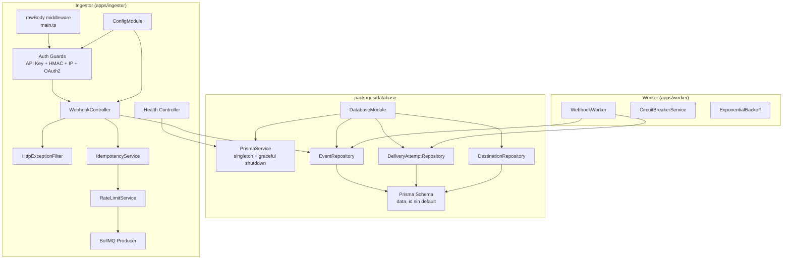

# Fase 2 — Ingestor Completo + Persistencia PostgreSQL

> **Dependencia:** Fase 1 completada ✅  
> **Duración estimada:** 4 días  
> **Objetivo:** Completar el Ingestor con persistencia real, guards funcionales, validación de entorno y health checks.

---

## 1. Resumen de Trabajo

| Ítem | Descripción | Prioridad |
|------|-------------|-----------|
| 1.1 | **packages/database/** — Prisma schema, servicio, repositorios, módulo compartido | 🔴 Alta |
| 1.2 | ConfigModule + ConfigSchema (env validation) | 🔴 Alta |
| 1.3 | HttpExceptionFilter (manejo centralizado errores) | 🔴 Alta |
| 1.4 | Health Check endpoint | 🔴 Alta |
| 1.5 | Guards funcionales (API Key, HMAC, IP, OAuth2) | 🟡 Media |
| 1.6 | rawBody middleware para HMAC (bytes exactos) | 🔴 Alta |
| 1.7 | Persistencia de eventos en Ingestor | 🟡 Media |
| 1.8 | Tests de integración del Ingestor | 🟡 Media |

---

## 2. Decisiones Arquitectónicas (Post-Review)

### 🔴 Decisión #1 — Paquete Compartido de Base de Datos

**Problema:** Si Prisma y el PersistenceModule están dentro de `apps/worker/`, el Ingestor (en otra carpeta del monorepo) tendría que duplicar código o generar acoplamientos frágiles para persistir eventos.

**Solución:** Crear `packages/database/` como un paquete independiente dentro del monorepo. Contendrá:
- `prisma/schema.prisma` — Definición del esquema
- `src/prisma.service.ts` — PrismaClient singleton con graceful shutdown
- `src/event.repository.ts` — CRUD de WebhookEvent
- `src/delivery-attempt.repository.ts` — CRUD de DeliveryAttempt
- `src/destination.repository.ts` — CRUD de Destination
- `src/database.module.ts` — Módulo NestJS exportable
- `src/index.ts` — Barrel export

**Árbol resultante:**
```
packages/
├── shared/          # Interfaces, enums, DTOs (Fase 1)
└── database/        # Prisma, repositorios, módulo NestJS (Fase 2)
    ├── prisma/
    │   └── schema.prisma
    ├── src/
    │   ├── prisma.service.ts
    │   ├── event.repository.ts
    │   ├── delivery-attempt.repository.ts
    │   ├── destination.repository.ts
    │   ├── database.module.ts
    │   └── index.ts
    ├── package.json
    └── tsconfig.json
```

**Uso desde Ingestor y Worker:**
```typescript
// apps/ingestor/src/app.module.ts
import { DatabaseModule } from '@webhook-hub/database';

@Module({
  imports: [DatabaseModule],
})
export class AppModule {}

// apps/worker/src/app.module.ts
import { DatabaseModule } from '@webhook-hub/database';

@Module({
  imports: [DatabaseModule],
})
export class AppModule {}
```

---

### 🔴 Decisión #2 — Campo `data` en lugar de `payload`

**Problema:** El schema Prisma usaba `payload Json`, pero la interfaz `IWebhookEvent` define `data: Record<string, unknown>`. Había inconsistencia.

**Solución:** Usar `data Json` en Prisma para coincidir exactamente con la interfaz unificada.

```prisma
model WebhookEvent {
  id              String   @id              // UUID v7 generado por la app
  source          String
  type            String
  data            Json                     // ← payload → data
  idempotencyKey  String   @unique
  status          DeliveryStatus @default(PENDING)
  createdAt       DateTime @default(now()) @map("created_at")
  updatedAt       DateTime @updatedAt @map("updated_at")
  deliveryAttempts DeliveryAttempt[]
  @@index([status])
  @@index([createdAt])
  @@map("webhook_events")
}
```

---

### 🔴 Decisión #3 — ID sin `@default(uuid())`

**Problema:** Si Prisma auto-genera el UUID, perdemos la capacidad de usar **UUID v7** (orden cronológico) que mejora la indexación secuencial en PostgreSQL.

**Solución:** El controlador genera el UUID v7 de forma nativa. Prisma solo declara `@id` sin `@default(uuid())`.

```prisma
model WebhookEvent {
  id  String  @id    // ← Sin @default(uuid()). La app pasa el UUID v7.
  // ...
}
```

**Generación de UUID v7 en la app:**
```typescript
// utils/uuid.ts
import { v7 as uuidv7 } from 'uuid';  // uuid@9+ soporta v7

export function generateId(): string {
  return uuidv7();  // Orden cronológico, indexación secuencial
}
```

---

### 🔴 Decisión #4 — rawBody para HMAC

**Problema:** `JSON.stringify(request.body)` dentro del HmacGuard altera espacios, tabulaciones y orden de propiedades, rompiendo la firma HMAC.

**Solución:** En `main.ts`, interceptar el buffer crudo (rawBody) durante la lectura del stream HTTP y acoplarlo al request. El HmacGuard comparará bytes exactos.

```typescript
// apps/ingestor/src/main.ts
import { NestFactory } from '@nestjs/core';
import { ValidationPipe } from '@nestjs/common';
import { AppModule } from './app.module';
import { PinoLoggerService } from './common/logger/pino-logger.service';
import * as express from 'express';

async function bootstrap() {
  const app = await NestFactory.create(AppModule, {
    bufferLogs: true,
    rawBody: true,  // ← Habilita rawBody en NestJS
  });

  // Middleware para capturar rawBody como string
  app.use(
    express.json({
      verify: (req: any, _res, buf) => {
        req.rawBody = buf.toString();  // ← Buffer crudo exacto
      },
    }),
  );

  app.useLogger(app.get(PinoLoggerService));
  app.setGlobalPrefix('api/v1');
  app.useGlobalPipes(
    new ValidationPipe({
      whitelist: true,
      forbidNonWhitelisted: true,
      transform: true,
    }),
  );

  const port = process.env.INGESTOR_PORT || 3000;
  await app.listen(port);
  console.log(`Ingestor running on port ${port}`);
}
bootstrap();
```

**HmacGuard usando rawBody:**
```typescript
// apps/ingestor/src/auth/hmac.guard.ts
@Injectable()
export class HmacGuard implements CanActivate {
  canActivate(context: ExecutionContext): boolean {
    const request = context.switchToHttp().getRequest();
    const signature = request.headers['x-signature'];
    const rawBody = request.rawBody;  // ← Bytes exactos del cliente

    if (!signature || !rawBody) return false;

    // Buscar destination por API Key (desde request.headers['x-api-key'])
    const apiKey = request.headers['x-api-key'];
    const destination = this.getDestinationByApiKey(apiKey);
    if (!destination) return false;

    const expected = crypto
      .createHmac('sha256', destination.apiKey)
      .update(rawBody)               // ← rawBody, no JSON.stringify
      .digest('hex');

    return crypto.timingSafeEqual(
      Buffer.from(signature),
      Buffer.from(expected),
    );
  }
}
```

---

## 3. Arquitectura de la Fase 2



---

## 4. Plan de Implementación Detallado

### 4.1 packages/database/ (Día 1)

**Crear estructura:**
```
packages/database/
├── prisma/
│   └── schema.prisma
├── src/
│   ├── prisma.service.ts
│   ├── event.repository.ts
│   ├── delivery-attempt.repository.ts
│   ├── destination.repository.ts
│   ├── database.module.ts
│   └── index.ts
├── package.json
└── tsconfig.json
```

**Schema Prisma final:**
```prisma
generator client {
  provider = "prisma-client-js"
}

datasource db {
  provider = "postgresql"
  url      = env("DATABASE_URL")
}

model WebhookEvent {
  id              String   @id
  source          String
  type            String
  data            Json
  idempotencyKey  String   @unique
  status          DeliveryStatus @default(PENDING)
  createdAt       DateTime @default(now()) @map("created_at")
  updatedAt       DateTime @updatedAt @map("updated_at")

  deliveryAttempts DeliveryAttempt[]

  @@index([status])
  @@index([createdAt])
  @@map("webhook_events")
}

model DeliveryAttempt {
  id          String   @id @default(uuid()) @db.Uuid
  eventId     String   @map("event_id")
  attempt     Int      @default(1)
  status      DeliveryStatus
  httpStatus  Int?     @map("http_status")
  latencyMs   Int?     @map("latency_ms")
  error       String?
  workerId    String   @map("worker_id")
  createdAt   DateTime @default(now()) @map("created_at")

  event WebhookEvent @relation(fields: [eventId], references: [id])

  @@index([eventId])
  @@index([createdAt])
  @@map("delivery_attempts")
}

model Destination {
  id            String   @id @default(uuid()) @db.Uuid
  name          String   @unique
  url           String
  apiKey        String   @map("api_key")
  isActive      Boolean  @default(true) @map("is_active")
  circuitState  CircuitBreakerState @default(CLOSED)
  failureCount  Int      @default(0) @map("failure_count")
  lastFailureAt DateTime? @map("last_failure_at")
  createdAt     DateTime @default(now()) @map("created_at")

  @@map("destinations")
}

enum DeliveryStatus { PENDING DELIVERED FAILED RETRYING DEAD_LETTER }
enum CircuitBreakerState { CLOSED OPEN HALF_OPEN }
```

**PrismaService:**
```typescript
import { Injectable, OnModuleInit, OnModuleDestroy } from '@nestjs/common';
import { PrismaClient } from '@prisma/client';

@Injectable()
export class PrismaService extends PrismaClient implements OnModuleInit, OnModuleDestroy {
  async onModuleInit() {
    await this.$connect();
  }

  async onModuleDestroy() {
    await this.$disconnect();
  }
}
```

### 4.2 ConfigModule + Validación (Día 1)

**Archivos:**
- `apps/ingestor/src/config/config.module.ts`
- `apps/ingestor/src/config/config.schema.ts`

**Variables validadas con Joi:**
```
REDIS_HOST: string, default: localhost
REDIS_PORT: number, default: 6379
INGESTOR_PORT: number, default: 3000
DATABASE_URL: string, required
LOG_LEVEL: string, enum: debug|info|warn|error, default: info
NODE_ENV: string, enum: development|production|test, default: development
```

### 4.3 HttpExceptionFilter (Día 1)

```typescript
@Catch()
export class HttpExceptionFilter implements ExceptionFilter {
  catch(exception: unknown, host: ArgumentsHost) {
    const ctx = host.switchToHttp();
    const response = ctx.getResponse<Response>();
    const request = ctx.getRequest<Request>();

    const status = exception instanceof HttpException
      ? exception.getStatus()
      : HttpStatus.INTERNAL_SERVER_ERROR;

    const message = exception instanceof HttpException
      ? exception.message
      : 'Internal server error';

    // Log estructurado
    this.logger.error({ status, path: request.url, message });

    response.status(status).json({
      statusCode: status,
      message: status >= 500 && process.env.NODE_ENV === 'production'
        ? 'Internal server error'
        : message,
      timestamp: new Date().toISOString(),
      path: request.url,
    });
  }
}
```

### 4.4 Health Check (Día 2)

**Endpoints:**
- `GET /api/v1/health` → `{ status: 'ok', uptime, timestamp, version }`
- `GET /api/v1/health/ready` → Verifica Redis + PostgreSQL
- `GET /api/v1/health/live` → Verifica que el proceso está vivo

### 4.5 Guards Funcionales (Día 2-3)

**API Key Guard** — Consulta `Destination` por `apiKey`:
```typescript
const destination = await prisma.destination.findUnique({ where: { apiKey } });
if (!destination || !destination.isActive) throw new UnauthorizedException();
```

**HMAC Guard** — Usa `rawBody` (bytes exactos):
```typescript
const expected = crypto
  .createHmac('sha256', destination.apiKey)
  .update(request.rawBody)  // ← rawBody, no JSON.stringify
  .digest('hex');
return crypto.timingSafeEqual(Buffer.from(signature), Buffer.from(expected));
```

**IP Whitelist Guard** — Consulta whitelist del Destination:
```typescript
const whitelist = await prisma.destination.findUnique({ where: { apiKey } });
// TODO: validar request.ip contra whitelist.allowedIps[]
```

**OAuth2 Guard** — Valida JWT:
```typescript
const token = request.headers['authorization']?.replace('Bearer ', '');
// TODO: verify JWT with OAuth2 provider's public key
```

### 4.6 Persistencia de Eventos (Día 3)

```typescript
// apps/ingestor/src/webhook/webhook.service.ts
async persistEvent(event: IWebhookEvent): Promise<void> {
  await this.eventRepository.create({
    id: event.id,                    // UUID v7 generado por la app
    source: event.source,
    type: event.type,
    data: event.data as any,         // ← data, no payload
    idempotencyKey: event.idempotencyKey,
    status: DeliveryStatus.PENDING,
  });
}
```

### 4.7 Tests de Integración (Día 3-4)

**Suites:**
- `apps/ingestor/tests/health.test.ts`
- `apps/ingestor/tests/webhook.integration.test.ts`
- `apps/ingestor/tests/config.test.ts`

**Tests mínimos (10+):**
- Health endpoint responde 200
- ConfigModule rechaza env inválidas
- WebhookController acepta payload válido → 202
- WebhookController rechaza payload inválido → 400
- Idempotencia detecta duplicados → 200 duplicate
- Rate limiting bloquea después de N requests → 429
- API Key inválida → 401
- HMAC inválido → 401
- rawBody preserva formato exacto para HMAC
- Evento se persiste en PostgreSQL

---

## 5. Dependencias Nuevas

```json
{
  "packages/database/package.json": {
    "dependencies": {
      "@prisma/client": "^5.10.0"
    },
    "devDependencies": {
      "prisma": "^5.10.0"
    }
  },
  "apps/ingestor/package.json": {
    "dependencies": {
      "@webhook-hub/database": "*",
      "@nestjs/terminus": "^10.2.0",
      "uuid": "^9.0.0"
    },
    "devDependencies": {
      "@types/uuid": "^9.0.0"
    }
  },
  "apps/worker/package.json": {
    "dependencies": {
      "@webhook-hub/database": "*"
    }
  }
}
```

---

## 6. Riesgos y Mitigaciones

| Riesgo | Impacto | Mitigación |
|--------|---------|------------|
| PostgreSQL no disponible al iniciar | Ingestor no arranca | Health check con graceful degradation (responder 503) |
| Migraciones Prisma en producción | Downtime | Usar `prisma migrate deploy` en CI/CD, no en startup |
| API Keys en texto plano en DB | Seguridad | Usar hash bcrypt de las API Keys (postergado a Fase 5) |
| rawBody aumenta uso de memoria | Performance | Limitar tamaño de payload a 256KB con middleware |
| UUID v7 no soportado en `uuid` package | IDs no cronológicos | Usar `uuid@9+` que soporta `v7()` |

---

## 7. Criterios de Aceptación

- [ ] `packages/database/` creado con schema, servicio y repositorios
- [ ] `GET /api/v1/health` responde 200 con uptime
- [ ] `POST /api/v1/webhooks/:source/:type` persiste en PostgreSQL
- [ ] API Key inválida → 401 Unauthorized
- [ ] HMAC inválido (con rawBody) → 401 Unauthorized
- [ ] Payload sin campos requeridos → 400 Bad Request
- [ ] IdempotencyKey duplicado → 200 { status: "duplicate" }
- [ ] Rate limit excedido → 429 Too Many Requests
- [ ] Config con DATABASE_URL faltante → error en startup
- [ ] rawBody preserva formato exacto para verificación HMAC
- [ ] Tests de integración pasando (mínimo 10 tests)