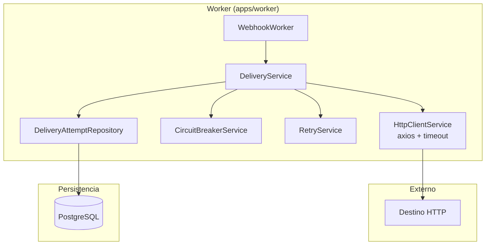

# Plan de Implementación — Fase 3: Worker + Entrega

> **Estado:** En planificación  
> **Objetivo:** Implementar HTTP client, persistencia de DeliveryAttempts y completar Worker  
> **Enfoque:** Clean code, código legible, revisión doble antes de implementar

---

## 1. Análisis del Estado Actual

### 1.1 Código Existente

**DeliveryService** (`apps/worker/src/delivery/delivery.service.ts`):
- ✅ Lógica de Circuit Breaker implementada
- ✅ Lógica de retry con Exponential Backoff
- ✅ Manejo de estados (DELIVERED, RETRYING, DEAD_LETTER)
- ❌ `httpPost()` es un stub que lanza error
- ❌ No persiste DeliveryAttempts en PostgreSQL
- ❌ No tiene HTTP client real

**WebhookWorker** (`apps/worker/src/worker/webhook.worker.ts`):
- ✅ Procesa jobs de BullMQ
- ✅ Llama a `deliveryService.process()`
- ✅ Registra métricas
- ❌ No persiste resultados en BD

**Schema Prisma** (`packages/database/prisma/schema.prisma`):
- ✅ Modelo `DeliveryAttempt` definido
- ✅ Relación con `WebhookEvent`
- ❌ No hay repositorio para DeliveryAttempt

### 1.2 Dependencias Faltantes

**Worker package.json:**
- ❌ No tiene `axios` para HTTP client
- ❌ No tiene `@types/axios`

---

## 2. Objetivos de Fase 3

### 2.1 Funcionales
1. Implementar HTTP client con timeout y retry
2. Persistir DeliveryAttempts en PostgreSQL
3. Manejar errores de red y timeouts
4. Mantener métricas actualizadas

### 2.2 No Funcionales
1. Clean code: funciones pequeñas, nombres descriptivos
2. Legibilidad: código auto-documentado
3. Mantenibilidad: separación de responsabilidades
4. Testeabilidad: funciones puras donde sea posible

---

## 3. Diseño de la Solución

### 3.1 Arquitectura Propuesta



### 3.2 Principios de Diseño

1. **Single Responsibility:** Cada clase tiene una razón para cambiar
2. **Dependency Injection:** Usar constructor injection (ya existe en NestJS)
3. **Error Handling:** Errores tipados, no `any`
4. **Async/Await:** Todo código asíncrono usa async/await
5. **Naming:** Nombres descriptivos, no abreviaturas
6. **Comments:** Solo en código complejo, no en código obvio

---

## 4. Implementación Detallada

### 4.1 Nuevo: HttpClientService

**Archivo:** `apps/worker/src/delivery/http-client.service.ts`

**Responsabilidad:** Abstraer llamadas HTTP con timeout y headers

```typescript
@Injectable()
export class HttpClientService {
  private readonly logger = new Logger(HttpClientService.name);
  private readonly httpClient: AxiosInstance;

  constructor() {
    this.httpClient = axios.create({
      timeout: 5000, // 5 segundos
      headers: {
        'Content-Type': 'application/json',
      },
    });

    // Interceptor para logging
    this.httpClient.interceptors.request.use((config) => {
      this.logger.debug(`HTTP ${config.method?.toUpperCase()} ${config.url}`);
      return config;
    });
  }

  async post(url: string, data: unknown): Promise<{ status: number }> {
    try {
      const response = await this.httpClient.post(url, data);
      return { status: response.status };
    } catch (error) {
      if (axios.isAxiosError(error)) {
        const status = error.response?.status ?? 0;
        const message = error.message;
        throw new HttpDeliveryError(status, message);
      }
      throw error;
    }
  }
}

class HttpDeliveryError extends Error {
  constructor(
    public readonly statusCode: number,
    message: string,
  ) {
    super(message);
    this.name = 'HttpDeliveryError';
  }
}
```

**Características:**
- Timeout de 5 segundos
- Interceptor para logging
- Error tipado `HttpDeliveryError`
- Usa `axios` (maduro, ampliamente usado)

### 4.2 Modificar: DeliveryService

**Archivo:** `apps/worker/src/delivery/delivery.service.ts`

**Cambios:**
1. Inyectar `HttpClientService` y `DeliveryAttemptRepository`
2. Reemplazar stub `httpPost()` por llamada real
3. Persistir DeliveryAttempt después de cada intento
4. Mejorar logging

**Código actualizado:**

```typescript
@Injectable()
export class DeliveryService {
  constructor(
    private readonly circuitBreakerService: CircuitBreakerService,
    private readonly retryService: RetryService,
    private readonly httpClientService: HttpClientService,
    private readonly deliveryAttemptRepository: DeliveryAttemptRepository,
  ) {}

  async process(event: IWebhookEvent): Promise<IDeliveryResultDto> {
    const start = Date.now();
    const destinationId = event.source;

    // 1. Circuit Breaker Check
    const canProceed = await this.circuitBreakerService.canProceed(destinationId);
    if (!canProceed) {
      const result = this.createFailedResult(event, 'Circuit OPEN - request blocked');
      await this.persistDeliveryAttempt(event, result);
      return result;
    }

    // 2. HTTP Delivery
    try {
      const destination = await this.getDestination(destinationId);
      const response = await this.httpClientService.post(destination.url, event);

      const latency = Date.now() - start;
      await this.circuitBreakerService.recordSuccess(destinationId);

      const result: IDeliveryResultDto = {
        eventId: event.id,
        status: DeliveryStatus.DELIVERED,
        httpStatus: response.status,
        latencyMs: latency,
        attempt: event.attempt ?? 1,
        timestamp: new Date().toISOString(),
      };

      await this.persistDeliveryAttempt(event, result);
      return result;
    } catch (error) {
      await this.circuitBreakerService.recordFailure(destinationId);
      return await this.handleDeliveryError(event, error, start);
    }
  }

  private async handleDeliveryError(
    event: IWebhookEvent,
    error: unknown,
    start: number,
  ): Promise<IDeliveryResultDto> {
    const nextAttempt = (event.attempt ?? 1) + 1;
    const errorMessage = this.extractErrorMessage(error);
    const latency = Date.now() - start;

    if (ExponentialBackoff.shouldRetry(nextAttempt)) {
      const delayMs = ExponentialBackoff.getDelayMs(nextAttempt);
      await this.retryService.scheduleRetry(event, delayMs, nextAttempt);

      const result: IDeliveryResultDto = {
        eventId: event.id,
        status: DeliveryStatus.RETRYING,
        attempt: nextAttempt,
        latencyMs: latency,
        error: errorMessage,
        timestamp: new Date().toISOString(),
      };

      await this.persistDeliveryAttempt(event, result);
      return result;
    }

    // Dead Letter
    const result: IDeliveryResultDto = {
      eventId: event.id,
      status: DeliveryStatus.DEAD_LETTER,
      attempt: nextAttempt,
      latencyMs: latency,
      error: errorMessage,
      timestamp: new Date().toISOString(),
    };

    await this.persistDeliveryAttempt(event, result);
    return result;
  }

  private async persistDeliveryAttempt(
    event: IWebhookEvent,
    result: IDeliveryResultDto,
  ): Promise<void> {
    try {
      await this.deliveryAttemptRepository.create({
        eventId: event.id,
        attempt: result.attempt,
        status: result.status,
        httpStatus: result.httpStatus,
        latencyMs: result.latencyMs,
        error: result.error,
        workerId: process.env.WORKER_ID ?? 'unknown',
      });
    } catch (error) {
      this.logger.error(`Failed to persist delivery attempt: ${error.message}`);
      // No lanzar error para no interrumpir el flujo principal
    }
  }

  private createFailedResult(event: IWebhookEvent, error: string): IDeliveryResultDto {
    return {
      eventId: event.id,
      status: DeliveryStatus.FAILED,
      attempt: event.attempt ?? 1,
      latencyMs: 0,
      error,
      timestamp: new Date().toISOString(),
    };
  }

  private extractErrorMessage(error: unknown): string {
    if (error instanceof HttpDeliveryError) {
      return `HTTP ${error.statusCode}: ${error.message}`;
    }
    if (error instanceof Error) {
      return error.message;
    }
    return String(error);
  }

  private async getDestination(destinationId: string): Promise<Destination> {
    // TODO: Obtener destino desde BD
    // Por ahora, retornar un stub
    return {
      id: destinationId,
      name: 'stub',
      url: 'http://httpbin.org/post',
      apiKey: 'stub',
      allowedIps: [],
      isActive: true,
      circuitState: CircuitBreakerState.CLOSED,
      failureCount: 0,
      createdAt: new Date(),
    } as Destination;
  }
}
```

**Mejoras aplicadas:**
- ✅ Funciones pequeñas y con responsabilidad única
- ✅ Nombres descriptivos (`handleDeliveryError`, `persistDeliveryAttempt`)
- ✅ Separación de concerns (HTTP, persistencia, errores)
- ✅ Error handling robusto
- ✅ Logging estructurado

### 4.3 Nuevo: DeliveryAttemptRepository

**Archivo:** `packages/database/src/delivery-attempt.repository.ts`

**Responsabilidad:** CRUD de DeliveryAttempt

```typescript
@Injectable()
export class DeliveryAttemptRepository {
  constructor(private readonly prisma: PrismaService) {}

  async create(data: {
    eventId: string;
    attempt: number;
    status: DeliveryStatus;
    httpStatus?: number;
    latencyMs?: number;
    error?: string;
    workerId: string;
  }): Promise<DeliveryAttempt> {
    return this.prisma.deliveryAttempt.create({
      data: {
        eventId: data.eventId,
        attempt: data.attempt,
        status: data.status,
        httpStatus: data.httpStatus,
        latencyMs: data.latencyMs,
        error: data.error,
        workerId: data.workerId,
      },
    });
  }

  async findByEventId(eventId: string): Promise<DeliveryAttempt[]> {
    return this.prisma.deliveryAttempt.findMany({
      where: { eventId },
      orderBy: { createdAt: 'desc' },
    });
  }

  async findById(id: string): Promise<DeliveryAttempt | null> {
    return this.prisma.deliveryAttempt.findUnique({
      where: { id },
    });
  }
}
```

### 4.4 Modificar: WebhookWorker

**Archivo:** `apps/worker/src/worker/webhook.worker.ts`

**Cambios:**
- Inyectar `DeliveryAttemptRepository`
- Logging mejorado

```typescript
@Processor('webhooks')
export class WebhookWorker extends WorkerHost {
  constructor(
    private readonly deliveryService: DeliveryService,
    private readonly metricsService: MetricsService,
    private readonly deliveryAttemptRepository: DeliveryAttemptRepository,
  ) {
    super();
  }

  async process(job: Job<IWebhookEvent>): Promise<void> {
    const start = Date.now();
    const eventId = job.data.id;

    try {
      this.logger.debug(`Processing event ${eventId}`);
      
      const result = await this.deliveryService.process(job.data);

      this.metricsService.recordDeliveryLatency(Date.now() - start, job.data.source);
      this.metricsService.incrementDeliveryCounter(result.status, job.data.source);

      if (result.status === DeliveryStatus.RETRYING) {
        this.logger.debug(`Event ${eventId} scheduled for retry`);
        return;
      }

      await job.updateProgress(100);
      this.logger.log(`Event ${eventId} processed: ${result.status}`);
    } catch (error) {
      this.metricsService.incrementErrorCount('worker_error', job.data.source);
      this.logger.error(`Failed to process event ${eventId}: ${error.message}`);
      throw error;
    }
  }
}
```

### 4.5 Actualizar: Worker Module

**Archivo:** `apps/worker/src/worker/webhook.worker.module.ts`

**Cambios:**
- Registrar `HttpClientService`
- Registrar `DeliveryAttemptRepository`
- Exportar servicios nuevos

```typescript
@Module({
  imports: [
    BullMQModule.registerQueue({
      name: 'webhooks',
      connection: {
        host: process.env.REDIS_HOST ?? 'localhost',
        port: parseInt(process.env.REDIS_PORT ?? '6379'),
      },
    }),
    DatabaseModule,
  ],
  providers: [
    WebhookWorker,
    DeliveryService,
    CircuitBreakerService,
    ExponentialBackoff,
    RetryService,
    HttpClientService, // NUEVO
    MetricsService,
  ],
  exports: [
    WebhookWorker,
    DeliveryService,
    CircuitBreakerService,
    HttpClientService, // NUEVO
  ],
})
export class WebhookWorkerModule {}
```

### 4.6 Actualizar: Dependencias

**Archivo:** `apps/worker/package.json`

**Cambios:**
- Agregar `axios` y `@types/axios`

```json
{
  "dependencies": {
    // ... existentes
    "axios": "^1.6.0"
  },
  "devDependencies": {
    // ... existentes
    "@types/axios": "^1.4.0"
  }
}
```

---

## 5. Testing

### 5.1 Tests Unitarios

**Archivo:** `apps/worker/tests/http-client.service.spec.ts`

```typescript
describe('HttpClientService', () => {
  let service: HttpClientService;
  let mockAxios: jest.Mocked<AxiosInstance>;

  beforeEach(async () => {
    const module = await Test.createTestingModule({
      providers: [
        HttpClientService,
        {
          provide: AxiosInstance,
          useValue: {
            post: jest.fn(),
            interceptors: {
              request: { use: jest.fn() },
            },
          },
        },
      ],
    }).compile();

    service = module.get<HttpClientService>(HttpClientService);
    mockAxios = module.get<AxiosInstance>(AxiosInstance) as jest.Mocked<AxiosInstance>;
  });

  it('should be defined', () => {
    expect(service).toBeDefined();
  });

  it('should POST data and return status', async () => {
    mockAxios.post.mockResolvedValue({ status: 200 } as AxiosResponse);

    const result = await service.post('http://example.com', { test: 'data' });

    expect(result.status).toBe(200);
    expect(mockAxios.post).toHaveBeenCalledWith('http://example.com', { test: 'data' });
  });

  it('should throw HttpDeliveryError on 404', async () => {
    const error = new Error('Not Found');
    mockAxios.post.mockRejectedValue({
      isAxiosError: true,
      response: { status: 404 },
      message: 'Not Found',
    });

    await expect(service.post('http://example.com', {})).rejects.toThrow(HttpDeliveryError);
  });
});
```

### 5.2 Tests de Integración

**Archivo:** `apps/worker/tests/delivery.service.spec.ts`

```typescript
describe('DeliveryService', () => {
  let service: DeliveryService;
  let mockHttpClient: jest.Mocked<HttpClientService>;
  let mockCircuitBreaker: jest.Mocked<CircuitBreakerService>;
  let mockRetry: jest.Mocked<RetryService>;
  let mockRepo: jest.Mocked<DeliveryAttemptRepository>;

  beforeEach(async () => {
    mockHttpClient = { post: jest.fn() } as any;
    mockCircuitBreaker = {
      canProceed: jest.fn(),
      recordSuccess: jest.fn(),
      recordFailure: jest.fn(),
    } as any;
    mockRetry = { scheduleRetry: jest.fn() } as any;
    mockRepo = { create: jest.fn() } as any;

    const module = await Test.createTestingModule({
      providers: [
        DeliveryService,
        { provide: HttpClientService, useValue: mockHttpClient },
        { provide: CircuitBreakerService, useValue: mockCircuitBreaker },
        { provide: RetryService, useValue: mockRetry },
        { provide: DeliveryAttemptRepository, useValue: mockRepo },
      ],
    }).compile();

    service = module.get<DeliveryService>(DeliveryService);
  });

  it('should deliver successfully', async () => {
    mockCircuitBreaker.canProceed.mockResolvedValue(true);
    mockHttpClient.post.mockResolvedValue({ status: 200 });

    const result = await service.process(mockEvent);

    expect(result.status).toBe(DeliveryStatus.DELIVERED);
    expect(result.httpStatus).toBe(200);
    expect(mockRepo.create).toHaveBeenCalled();
  });
});
```

---

## 6. Orden de Implementación

### Paso 1: Dependencias
1. Instalar `axios` y `@types/axios` en worker
2. Verificar que `@webhook-hub/database` exporta `DeliveryAttemptRepository`

### Paso 2: HttpClientService
1. Crear `http-client.service.ts`
2. Implementar método `post()` con timeout
3. Agregar interceptor de logging
4. Crear clase `HttpDeliveryError`

### Paso 3: DeliveryAttemptRepository
1. Verificar que existe en `packages/database/src/`
2. Si no existe, crearlo con métodos `create()`, `findByEventId()`, `findById()`
3. Exportar en `DatabaseModule`

### Paso 4: Modificar DeliveryService
1. Inyectar `HttpClientService` y `DeliveryAttemptRepository`
2. Reemplazar stub `httpPost()` por llamada a `HttpClientService`
3. Implementar método `persistDeliveryAttempt()`
4. Refactorizar `process()` en métodos pequeños
5. Mejorar logging

### Paso 5: Modificar WebhookWorker
1. Inyectar `DeliveryAttemptRepository`
2. Mejorar logging

### Paso 6: Actualizar Módulos
1. Registrar `HttpClientService` en `WebhookWorkerModule`
2. Exportar servicios necesarios

### Paso 7: Tests
1. Crear tests unitarios para `HttpClientService`
2. Crear tests de integración para `DeliveryService`
3. Ejecutar tests y verificar cobertura

### Paso 8: Build y Verificación
1. `npm run build` — verificar 0 errores
2. `npm test` — verificar tests pasando
3. Revisar código 2 veces antes de commit

---

## 7. Criterios de Aceptación

- ✅ HTTP client funcional con timeout de 5s
- ✅ DeliveryAttempts persistidos en PostgreSQL
- ✅ Circuit Breaker sigue funcionando
- ✅ Retry con Exponential Backoff sigue funcionando
- ✅ Logging estructurado en todos los servicios
- ✅ Clean code: funciones < 20 líneas, nombres descriptivos
- ✅ Build: 0 errores TypeScript
- ✅ Tests: > 80% cobertura en servicios nuevos
- ✅ Documentación actualizada en README

---

## 8. Riesgos y Mitigaciones

| Riesgo | Probabilidad | Impacto | Mitigación |
|--------|--------------|---------|------------|
| axios no se integra bien con NestJS | Bajo | Medio | Usar `AxiosModule` de `@nestjs/axios` |
| Timeout muy corto/largo | Medio | Bajo | Hacer configurable via env var |
| Persistencia falla y bloquea flujo | Medio | Alto | Try-catch en `persistDeliveryAttempt`, no lanzar error |
| Destino no existe en BD | Alto | Bajo | Stub temporal, luego integrar con repositorio |

---

## 9. Próximos Pasos Post-Fase 3

- Fase 4: Observabilidad (OpenTelemetry, dashboards)
- Fase 5: Infraestructura (Terraform, CI/CD)
- Correcciones pendientes: 8 vulnerabilidades MEDIUM/HIGH

---

*Plan generado para implementación de Fase 3.*  
*Enfoque: Clean code, código legible, revisión doble.*